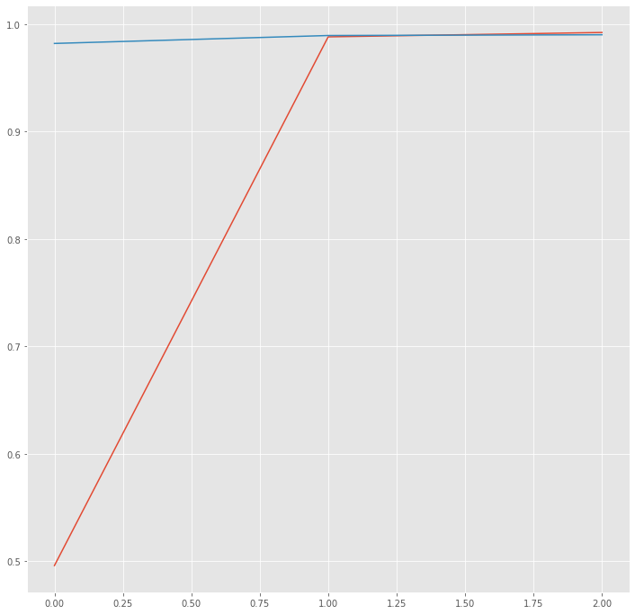
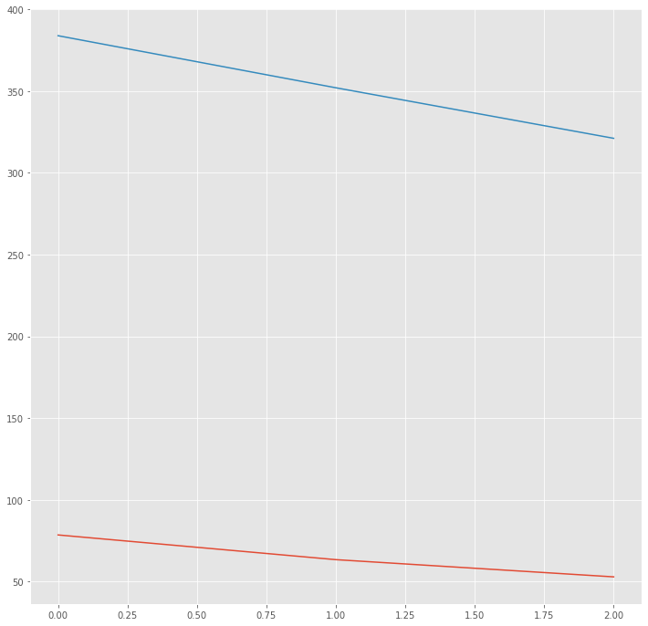

#### Table of contents
1. [Introduction](#introduction)
2. [Training procedure](#training)
3. [Experiments](#experiments)
    - [data](#data)
    - [features](#features)
        - [word embedding](#word)
    - [results](#results)
4. [References](#reference)
5. [Usage](#usage)

#  Bidirectional LSTM-CRF model for Sequence Tagging
A Tensorflow 2/Keras implementation of POS tagging task using Bidirectional Long Short Term Memory (denoted as BiLSTM) with Conditional Random Field on top of that BiLSTM layer (at the inference layer) to predict the most relevant POS tags. My work is not the first to apply a BI-LSTM-CRF model to NLP sequence tagging benchmark datasets but it might achieve State-Of-The-Art (or nearly) results on POS tagging, even with NER. Experimental results on the POS tagging corpus Penn Treebank (approximately 1 million tokens for Wall Street Journal) show that my model might achieve SOTA (reaching 98.93% accuracy at word level).
##  Training procedure
- batch size: 256
- learning rate: 0.001
- number of epochs: 3
- max lengh (the number of timesteps): 141
- embedding size: 100
- number of tags: 45
- hidden BiLSTM layer: 1
- hidden BiLSTM units: 100
- recurrent dropout: 0.01
##  Experiments
###  Data
I test BI-LSTM-CRF networks on the Penn Treebank (POS tagging task), the table below shows the size of sentences, tokens and labels for training, validation and test sets respectively
 *PTB POS* | |  | 
 | :--- | :--- | :--- | 
 *training* | sentence #, token # | 33458, 798284 | 
 *validation* | sentence #, token # | 6374, 151744 |  
 *test* | sentence #, token # | 1346, 32853 |
  | | | | | 
   |  | label #  | 45 |
###  Features
####  Word Embedding
For Word Representation, i used pretrained word embedding [Glove](https://nlp.stanford.edu/projects/glove/) which each word corresponds to a 100-dimentional embedding vector.
###  Results

First, i set batch size to 64, the model was overfitting at epoch 2, then i changed batch size to 128, it was at epoch 3. Eventually, i set batch size to 256 and it reached the highest accuarcy (at word level): 98.93%.

##  References

My implementation is based on the following paper: 

Huang, et al. ["Bidirectional LSTM-CRF Models for Sequence Tagging"](https://arxiv.org/abs/1508.01991) arXiv preprint arXiv:1508.01991 (2015).

## Usage
###  Requirements

- Tensorflow 2/Keras
- Numpy
- JSON
- NLTK
- argparse

        $ pip install requirements
        
### Training and Evaluating

        $ python train.py
Output:

        $ Viterbi accuracy: 98.93%
        
#### Graphs:

Accuracy

Loss

### Testing
        $ python test.py --sent "My heart is always breaking for the ghosts that haunt this room."
Output:

        $ [('My', 'prp$'), ('heart', 'nn'), ('is', 'vbz'), ('always', 'rb'), ('breaking', 'vbg'), ('for', 'in'), ('the', 'dt'), ('ghosts', 'nns'), ('that', 'wdt'), ('haunt', 'vbp'), ('this', 'dt'), ('room', 'nn'), ('.', '.')]
